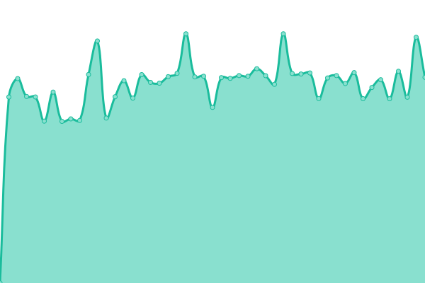
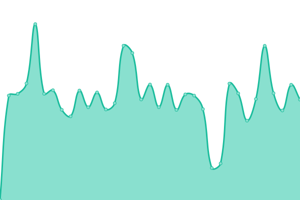
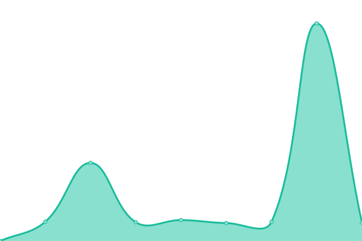

# [📈 Live Status](https://Yourrrrlove.github.io/upptime): <!--live status--> **🟧 部分停机**

This repository contains the open-source uptime monitor and status page for [Yourrrrlove](https://Yourrrrlove.github.io/upptime), powered by [Upptime](https://github.com/upptime/upptime).

With [Upptime](https://upptime.js.org), you can get your own unlimited and free uptime monitor and status page, powered entirely by a GitHub repository. We use [Issues](https://github.com/Yourrrrlove/upptime/issues) as incident reports, [Actions](https://github.com/Yourrrrlove/upptime/actions) as uptime monitors, and [Pages](https://Yourrrrlove.github.io/upptime) for the status page.

<!--start: status pages-->
<!-- This summary is generated by Upptime (https://github.com/upptime/upptime) -->
<!-- Do not edit this manually, your changes will be overwritten -->
<!-- prettier-ignore -->
| 链接 | 状态 | 历史 | 响应时间 | 正常运行时间 |
| --- | ------ | ------- | ------------- | ------ |
|  [Xiaohongshu-Wang](https://www.xiaohongshu.com/user/profile/5d1d9a0400000000160115c6?xhsshare=CopyLink&appuid=64d8c888000000000100dc16&apptime=1691929476) | 🟩 正常运行 | [xiaohongshu-wang.yml](https://github.com/Yourrrrlove/upptime/commits/HEAD/history/xiaohongshu-wang.yml) | 

 1422毫秒
     
 | 

<a href="https://Yourrrrlove.github.io/upptime/history/xiaohongshu-wang">100.00%</a>
    

|  [TodayHIT](http://today.hit.edu.cn) | 🟩 正常运行 | [today-hit.yml](https://github.com/Yourrrrlove/upptime/commits/HEAD/history/today-hit.yml) | 

 3727毫秒
     
 | 

<a href="https://Yourrrrlove.github.io/upptime/history/today-hit">100.00%</a>
    

|  [HITISE](http://ise.hit.edu.cn) | 🟩 正常运行 | [hitise.yml](https://github.com/Yourrrrlove/upptime/commits/HEAD/history/hitise.yml) | 

 1753毫秒
     
 | 

<a href="https://Yourrrrlove.github.io/upptime/history/hitise">100.00%</a>
    

|  [HITmaster](http://hitgs.hit.edu.cn/) | 🟩 正常运行 | [hi-tmaster.yml](https://github.com/Yourrrrlove/upptime/commits/HEAD/history/hi-tmaster.yml) | 

 1584毫秒
     
 | 

<a href="https://Yourrrrlove.github.io/upptime/history/hi-tmaster">100.00%</a>
    

|  [UPC](https://www.upc.edu.cn/) | 🟩 正常运行 | [upc.yml](https://github.com/Yourrrrlove/upptime/commits/HEAD/history/upc.yml) | 

 4009毫秒
     
 | 

<a href="https://Yourrrrlove.github.io/upptime/history/upc">98.80%</a>
    

|  [UPCME](http://medwww.upc.edu.cn) | 🟥 停机 | [upcme.yml](https://github.com/Yourrrrlove/upptime/commits/HEAD/history/upcme.yml) | 

 2577毫秒
     
 | 

<a href="https://Yourrrrlove.github.io/upptime/history/upcme">23.50%</a>
    

|  [HITLYQ](http://homepage.hit.edu.cn/liyongqiang) | 🟩 正常运行 | [hitlyq.yml](https://github.com/Yourrrrlove/upptime/commits/HEAD/history/hitlyq.yml) | 

 1653毫秒
     
 | 

<a href="https://Yourrrrlove.github.io/upptime/history/hitlyq">100.00%</a>
    

|  [cheeselist](https://www.runningcheese.com/aaa) | 🟩 正常运行 | [cheeselist.yml](https://github.com/Yourrrrlove/upptime/commits/HEAD/history/cheeselist.yml) | 

 5090毫秒
     
 | 

<a href="https://Yourrrrlove.github.io/upptime/history/cheeselist">99.85%</a>
    

|  [runningcheese](https://www.runningcheese.com) | 🟩 正常运行 | [runningcheese.yml](https://github.com/Yourrrrlove/upptime/commits/HEAD/history/runningcheese.yml) | 

 898毫秒
     
 | 

<a href="https://Yourrrrlove.github.io/upptime/history/runningcheese">100.00%</a>
    

<!--end: status pages-->

[**Visit our status website →**](https://Yourrrrlove.github.io/upptime)

## 📄 License

- Powered by: [Upptime](https://github.com/upptime/upptime)
- Code: [MIT](./LICENSE) © [Yourrrrlove](https://Yourrrrlove.github.io/upptime)
- Data in the `./history` directory: [Open Database License](https://opendatacommons.org/licenses/odbl/1-0/)
